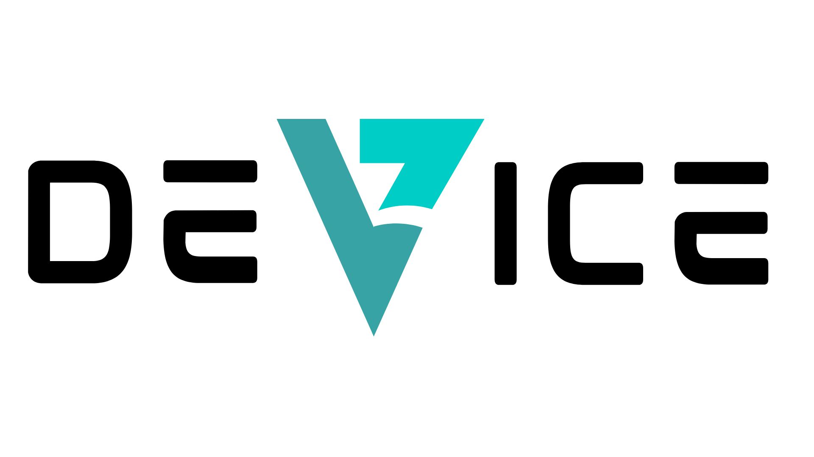

# **DeVice** 

## ***From Distractions to Interactions***



## 1\. Introduction 👋
>DeVice helps teenagers live more meaningful lives by reducing dopamine-driven addiction and fostering healthier relationships with technology, enabling genuine connections, improved mental health, real-world engagement, and long-term focus.

## 2\. Main Features 📝
* Interactive Calender and Map displaying nea by events, workshops, activities etc. (alternative off-screen activities)
* Game which displays challenges regarding alternative acts (running, meditation, walk in nature...)

## 3\. Download & Installation 📥

### Prerequisites

##### Before installing **DeVice**, ensure you have the following installed:

* **Node.js** (latest LTS version) – [Download here](https://nodejs.org/)  
* **npm** (comes with Node.js) 
* **React Native CLI**  
* **Expo CLI** (if using Expo)  
* **Visual Studio Code** - [Download here](https://code.visualstudio.com/download)

##### 0\. Check if everything is installed by running: 🖱️  

```
node -v  # Check Node.js version    
npm -v  # Check npm version    
```
##### 1\. Clone Repository 🗽
```
git clone https://github.com/EitanJa24-meet/DeVice.git
cd DeVice
```

##### 2\. Install Dependencies 🎁
```
npm install
```
##### 3\. Install Expo CLI (if using Expo) 📱
```
npm install -g expo-cli
```

##### 4\. Additional Dependencies 🚦
```
npx expo install expo-router react-native-safe-area-context react-native-screens expo-linking expo-linking expo-constants expo-status-bar 
```

##### 5\. Run the App 🏁

```
npx expo start
```


<!-- # Welcome to your Expo app 👋 -->
<!-- 
This is an [Expo](https://expo.dev) project created with [`create-expo-app`](https://www.npmjs.com/package/create-expo-app).

## Get started

1. Install dependencies

   ```bash
   npm install
   ```

2. Start the app

   ```bash
    npx expo start
   ```

In the output, you'll find options to open the app in a

- [development build](https://docs.expo.dev/develop/development-builds/introduction/)
- [Android emulator](https://docs.expo.dev/workflow/android-studio-emulator/)
- [iOS simulator](https://docs.expo.dev/workflow/ios-simulator/)
- [Expo Go](https://expo.dev/go), a limited sandbox for trying out app development with Expo

You can start developing by editing the files inside the **app** directory. This project uses [file-based routing](https://docs.expo.dev/router/introduction).

## Get a fresh project

When you're ready, run:

```bash
npm run reset-project
```

This command will move the starter code to the **app-example** directory and create a blank **app** directory where you can start developing.

## Learn more

To learn more about developing your project with Expo, look at the following resources:

- [Expo documentation](https://docs.expo.dev/): Learn fundamentals, or go into advanced topics with our [guides](https://docs.expo.dev/guides).
- [Learn Expo tutorial](https://docs.expo.dev/tutorial/introduction/): Follow a step-by-step tutorial where you'll create a project that runs on Android, iOS, and the web.

## Join the community

Join our community of developers creating universal apps.

- [Expo on GitHub](https://github.com/expo/expo): View our open source platform and contribute.
- [Discord community](https://chat.expo.dev): Chat with Expo users and ask questions. -->
